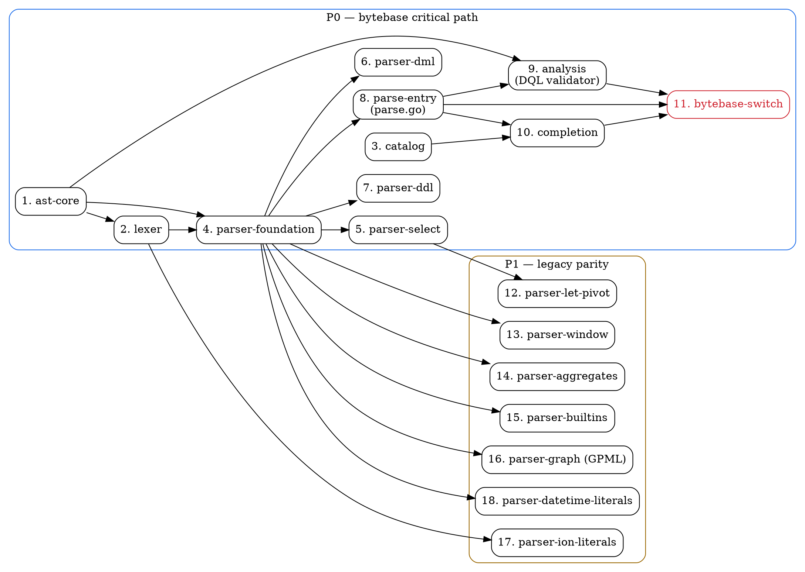

# PartiQL Migration DAG

Feature dependency graph for migrating the PartiQL (DynamoDB / Cosmos DB)
parser from `bytebase/parser/partiql` (ANTLR4) to `bytebase/omni/partiql`
(hand-written). Source: [analysis.md](./analysis.md).

Linear umbrella issue: BYT-9000.

**Engine constant in bytebase:** `storepb.Engine_DYNAMODB`.
**Reference engines:** `cosmosdb/` (most similar — also NoSQL, hand-written, recent),
`mongo/` (NoSQL conventions).

Conventions follow `cosmosdb/` and `mongo/`:

- `partiql/ast/`         — AST node types
- `partiql/parser/`      — Lexer + recursive-descent parser
- `partiql/analysis/`    — Statement classification (DQL validator)
- `partiql/catalog/`     — Schema metadata for DynamoDB-style collections
- `partiql/completion/`  — Auto-complete candidates
- `partiql/parse.go`     — Public `Parse()` entry point with statement framing
- `partiql/parsertest/`  — Test corpus support (if useful)

## Nodes

| # | Node | Package | Depends On | Can Parallelize With | Priority | Status |
|---|------|---------|------------|----------------------|----------|--------|
| 1 | ast-core | `partiql/ast` | (none) | lexer, catalog | **P0** | done |
| 2 | lexer | `partiql/parser` (lexer.go, token.go, keywords.go) | ast-core | catalog | **P0** | done |
| 3 | catalog | `partiql/catalog` | (none) | ast-core, lexer | **P0** | not started |
| 4 | parser-foundation | `partiql/parser` (parser.go, expr.go, exprprimary.go, path.go, literals.go) | ast-core, lexer | — | **P0** | done |
| 5 | parser-select | `partiql/parser` (select.go, from.go) | parser-foundation | parser-dml, parser-ddl (logically — same files conflict) | **P0** | done |
| 6 | parser-dml | `partiql/parser` (dml.go) | parser-foundation | parser-select, parser-ddl (logically — same files conflict) | **P0** | done |
| 7 | parser-ddl | `partiql/parser` (ddl.go) | parser-foundation | parser-select, parser-dml (logically — same files conflict) | **P0** | done |
| 8 | parse-entry | `partiql/parse.go` + `partiql/parse_test.go` | parser-foundation | parser-select/dml/ddl (entry can land before they all complete) | **P0** | not started |
| 9 | analysis | `partiql/analysis` | ast-core, parse-entry | catalog, completion-foundation | **P0** | not started |
| 10 | completion | `partiql/completion` | parse-entry, catalog | analysis | **P0** | not started |
| 11 | bytebase-switch | bytebase wrapper rewrite | parse-entry, analysis, completion | — | **P0** | not started |
| 12 | parser-let-pivot | `partiql/parser` (select.go) | parser-select | parser-window, parser-aggregates, parser-builtins, parser-graph, parser-ion-literals, parser-datetime-literals | **P1** | not started |
| 13 | parser-window | `partiql/parser` (expr.go, function.go) | parser-foundation | parser-let-pivot, parser-aggregates, parser-builtins, parser-graph, parser-ion-literals, parser-datetime-literals | **P1** | not started |
| 14 | parser-aggregates | `partiql/parser` (function.go) | parser-foundation | parser-let-pivot, parser-window, parser-builtins, parser-graph, parser-ion-literals, parser-datetime-literals | **P1** | not started |
| 15 | parser-builtins | `partiql/parser` (function.go, expr.go) | parser-foundation | parser-let-pivot, parser-window, parser-aggregates, parser-graph, parser-ion-literals, parser-datetime-literals | **P1** | not started |
| 16 | parser-graph | `partiql/parser` (graph.go) | parser-foundation | parser-let-pivot, parser-window, parser-aggregates, parser-builtins, parser-ion-literals, parser-datetime-literals | **P1** | not started |
| 17 | parser-ion-literals | `partiql/parser` (lexer.go) | lexer | parser-let-pivot, parser-window, parser-aggregates, parser-builtins, parser-graph, parser-datetime-literals | **P1** | not started |
| 18 | parser-datetime-literals | `partiql/parser` (literals.go, expr.go) | parser-foundation | parser-let-pivot, parser-window, parser-aggregates, parser-builtins, parser-graph, parser-ion-literals | **P1** | not started |

Priority key: **P0** = on the critical path to bytebase migration (the four
features bytebase actually consumes — splitter / parse / DQL validator / completion);
**P1** = legacy parser parity that omni must implement to fully replace the ANTLR
grammar, but bytebase doesn't actively consume today.

## Visual Dependency Graph

## Execution Order

### Phase 1 — Foundations (parallelizable)

Three independent nodes can run in parallel:

1. **ast-core** — node interfaces, `Loc`, literal nodes, statement/expression/path/collection/type node taxonomy
2. **lexer** — tokens, keywords, identifiers, numbers, strings, `;` delimiter, position tracking. (Ion backtick mode is split out as P1 node #17.)
3. **catalog** — DynamoDB-style schema metadata (tables = collections, columns = attribute paths). Independent of parser entirely.

### Phase 2 — Parser foundation (blocking)

4. **parser-foundation** — Parser scaffolding (advance/peek/match/expect, error recovery), expression precedence (Pratt or precedence-climbing), path expressions (`.field`, `.*`, `[expr]`, `[*]`, chained), variables (`@id`, bare `id`, `?`), collection literals (`[...]`, `{k:v}`), basic SELECT smoke path, splitter.

This must land before any other parser feature work.

### Phase 3 — Statement coverage (logically parallel, file-conflict serial)

Nodes 5–7 can be designed in parallel but their commits will likely serialize because
they touch overlapping files. The **brainstorms can happen concurrently**; merging
should be sequential.

5. **parser-select** — full SELECT clause set: `FROM` with `AS`/`AT`/`BY`, joins
   (`CROSS`/`INNER`/`LEFT`/`RIGHT`/`FULL`/bare `OUTER`), `WHERE`, `GROUP BY`/`HAVING`,
   `ORDER BY`, `LIMIT`/`OFFSET`, set operations (`UNION`/`INTERSECT`/`EXCEPT`),
   subqueries, `EXPLAIN` prefix
6. **parser-dml** — `INSERT INTO … VALUE …` (legacy + RFC 0011), `UPDATE … SET …`,
   `DELETE FROM … WHERE …`, `UPSERT`, `REPLACE`, `REMOVE`, `ON CONFLICT … DO NOTHING /
   DO REPLACE EXCLUDED / DO UPDATE EXCLUDED`, `RETURNING`
7. **parser-ddl** — `CREATE TABLE`, `CREATE INDEX (path,…)`, `DROP TABLE`,
   `DROP INDEX … ON …`, `EXEC name args…`

### Phase 4 — Public entry point (can land alongside Phase 3)

8. **parse-entry** — `partiql/parse.go` with `Parse()` returning `[]Statement` and
   `ParseBestEffort()` returning a `*ParseResult` (mirroring `mongo/parse.go`).
   Statement framing, position tracking, best-effort error recovery.

### Phase 5 — Analysis & completion (parallelizable)

9. **analysis** — DQL-only query validator (mirror of legacy `validateQuery`). Walks
   the AST and rejects DDL/DML/EXEC. Uses node-tag dispatch, no listener machinery.
10. **completion** — Auto-complete using cursor scope. Surfaces table names from FROM
    scope and column names from current SELECT scope. Mirror the candidate types from
    the legacy `completion.go`. Test cases mirror `test_completion.yaml`.

These two are independent and can run concurrently.

### Phase 6 — Bytebase switch (final P0)

11. **bytebase-switch** — Rewrite `bytebase/backend/plugin/parser/partiql/`
    (`partiql.go`, `split.go`, `query.go`, `completion.go`) to call into the new
    omni parser. Replace `github.com/bytebase/parser/partiql` imports with
    `github.com/bytebase/omni/partiql`. The four `init()` registrations
    (`RegisterParseStatementsFunc`, `RegisterSplitterFunc`, `RegisterQueryValidator`,
    `RegisterCompleteFunc`) stay the same — only the implementation changes. The
    one external caller (`backend/plugin/db/dynamodb/dynamodb.go`) does not need
    updating because it goes through `base.SplitMultiSQL`. Run the existing
    `test_split.yaml` and `test_completion.yaml` corpora as the regression suite.

### Phase 7 — Legacy parity (post-bytebase, fully parallelizable)

Once bytebase has switched, the remaining P1 nodes can land in any order. None of
them block bytebase. They are parallelizable with each other (different files /
different concerns), with the caveat that some touch shared parser files (note in
the table).

12. **parser-let-pivot** — `LET expr AS alias, …`, `PIVOT … AT …`, `UNPIVOT … [AS] [AT] [BY]`
13. **parser-window** — `LAG`/`LEAD` window functions with `OVER (PARTITION BY … ORDER BY …)`
14. **parser-aggregates** — `COUNT(*)`, `COUNT/SUM/AVG/MIN/MAX([DISTINCT|ALL] expr)`
15. **parser-builtins** — `CAST/CAN_CAST/CAN_LOSSLESS_CAST`, `EXTRACT`, `TRIM`,
    `SUBSTRING`, `DATE_ADD`, `DATE_DIFF`, `COALESCE`, `NULLIF`, `CASE [expr] WHEN …
    THEN … ELSE … END`, `CHAR_LENGTH`/`OCTET_LENGTH`/`BIT_LENGTH`/`UPPER`/`LOWER`/
    `SIZE`/`EXISTS`
16. **parser-graph** — Graph Pattern Matching (MATCH clauses with nodes, edges,
    quantifiers `+ * {m,n}`, selectors `ANY`/`ALL SHORTEST`/`SHORTEST k`,
    restrictors `TRAIL`/`ACYCLIC`/`SIMPLE`, path variables). **Largest single
    feature** — budget accordingly.
17. **parser-ion-literals** — Backtick-delimited inline Ion values via dedicated
    lexer mode (the existing PartiQLLexer.g4 has a full ION mode at lines 327–403)
18. **parser-datetime-literals** — `DATE 'Y-M-D'`, `TIME [(p)] [WITH TIME ZONE] '…'`,
    `TIMESTAMP '…'` literal forms

## Out of Scope

The following packages exist for some omni engines but have **no bytebase consumer**
for PartiQL today and are explicitly out of scope until that changes:

- `partiql/semantic/` — type checking, semantic validation
- `partiql/quality/`  — lint / quality checks
- `partiql/deparse/`  — AST → SQL string

If bytebase later wires up schema sync, query span, masking, or DML transformation
for DynamoDB, add new DAG nodes at that time.

## Notes

- **Bytebase coupling is shallow.** Only one direct caller exists outside
  init-time registration (`backend/plugin/db/dynamodb/dynamodb.go`), and it goes
  through the generic `base.SplitMultiSQL`. Switching the import is mechanically
  small once nodes 1–10 are done.
- **Graph Pattern Matching is the largest single feature** with no analogue in
  other omni engines. Treat node 16 as a major sub-project — its brainstorm should
  reference the GPML spec, not just the legacy `.g4` file. It is intentionally
  P1 because no bytebase consumer requires it today; deferring it does not block
  the import switch.
- **Two DML syntaxes coexist** in PartiQL (legacy path-based `FROM … DELETE …`
  and RFC 0011 modern `DELETE FROM …`). The DML node must accept both spellings;
  test fixtures should cover each.
- **Ion lexer mode** is mode-switched on backticks. Splitting it out as P1
  (node 17) because the bytebase test corpus does not exercise it; the foundational
  lexer (node 2) only needs the standard SQL lexical structure plus `;` and
  identifiers. Wire the mode in later without changing the rest of the lexer.
- **Test corpus.** The legacy `simple.sql` is 5 lines and useless as a regression
  suite. Build the omni test corpus by:
  1. Cross-referencing each `.g4` rule from `analysis.md` to a positive/negative
     case
  2. Re-running the existing `bytebase/backend/plugin/parser/partiql/test-data/`
     YAML fixtures (`test_split.yaml`, `test_completion.yaml`) against the new
     parser as a regression check before the bytebase switch
  3. Pulling examples from the official PartiQL spec / AWS DynamoDB PartiQL
     reference for clauses not exercised by the existing fixtures
- **`ON CONFLICT DO REPLACE/UPDATE` are stubs in legacy** (only `EXCLUDED`
  parses). The omni parser should match this behavior in node 6 (parser-dml) — not
  silently extend it. Document the gap so a follow-up can complete it consistently
  with future PartiQL spec updates.
- **Best-effort recovery.** Match `mongo/parse.go`'s pattern: skip to the next
  statement boundary on syntax error and keep going. The completion engine relies
  on this — half-typed statements must still produce a usable AST stub.

## Status Tracking Legend

- `not started` — not yet begun
- `in progress` — currently being implemented (one node at a time per worker)
- `done` — implemented, tests passing, merged

When starting work on a node, change its status to `in progress`. When the node's
implementation is merged, change it to `done`. The implementing skill
(`omni-engine-implementing`) reads this table to pick the next actionable node.
